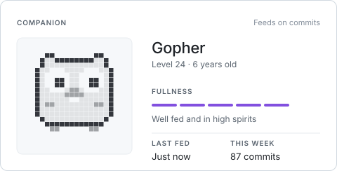

<!-- Fixed widths let the cards wrap: two per row on desktop, stacked on phones. -->

  <picture>
    <source media="(prefers-color-scheme: dark)" srcset="https://raw.githubusercontent.com/rudnam/rudnam/output/almanac-dark.svg">
    
  </picture>
  <picture>
    <source media="(prefers-color-scheme: dark)" srcset="https://raw.githubusercontent.com/rudnam/rudnam/output/hours-dark.svg">
    
  </picture>
  <picture>
    <source media="(prefers-color-scheme: dark)" srcset="https://raw.githubusercontent.com/rudnam/rudnam/output/year-dark.svg">
    
  </picture>
  <picture>
    <source media="(prefers-color-scheme: dark)" srcset="https://raw.githubusercontent.com/rudnam/rudnam/output/pet-dark.svg">
    
  </picture>

